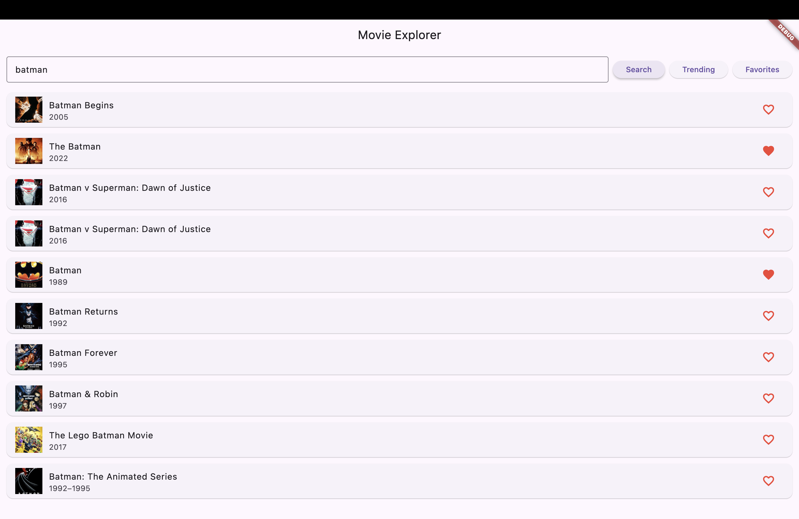
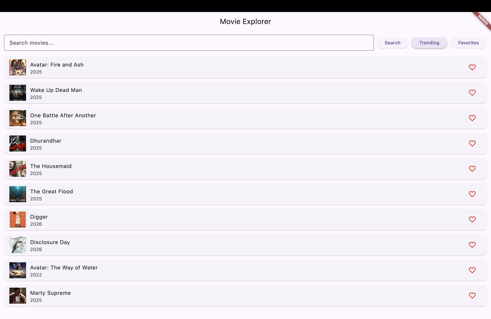
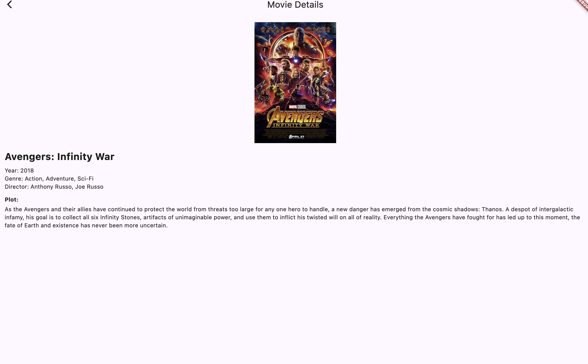
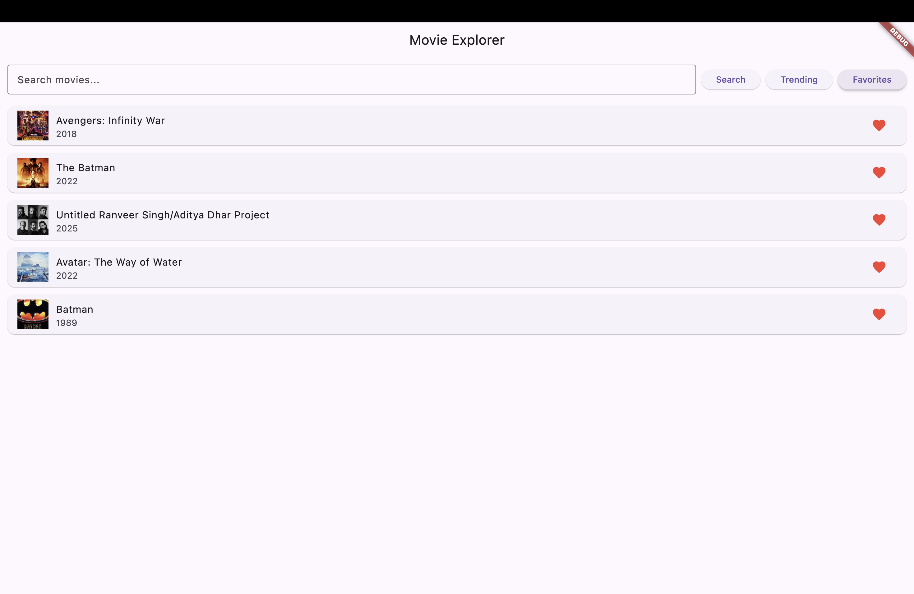

<div align="center">

  <h1>Movie Explorer</h1>
  <p><strong>A streamlined Flutter application for discovering movies, tracking trending titles, and managing your personal favorites list. Powered by the OMDb API and IMDb8 RapidAPI.</strong></p>

  <!-- Clickable Badges with Icons -->
  <p>
    <a href="https://flutter.dev" target="_blank">
      
    </a>
    <a href="https://dart.dev" target="_blank">
      
    </a>
    <a href="https://pub.dev/packages/http" target="_blank">
      
    </a>
    <a href="https://pub.dev/packages/shared_preferences" target="_blank">
      
    </a>
  </p>
</div>

---

## 📱 Main Screens of the Application

<div align="center">
  
  
  
  
  
</div>

---

## 📑 Table of Contents

- [🚀 Features](#-features)
- [🧑‍💻 Tech Stack](#-tech-stack)
- [🛠️ Setup Instructions](#️-setup-instructions)
- [📂 Project Structure](#-project-structure)
- [🎯 Future Goals](#-future-goals)
- [📬 Contact](#-contact)

---

## 🚀 Features

### 🔍 Powerful Movie Search
- **Instant Access**: Search for any movie title using the **OMDb API**.
- **Rich Results**: View movie posters, titles, and release years instantly in a list format.
- **Error Handling**: Graceful error messages when movies aren't found or network issues occur.

### 📈 Trending Movies
- **Real-Time Data**: Fetches the current top 10 most popular movies using the **IMDb8 RapidAPI**.
- **Smart Integration**: Automatically retrieves detailed metadata (posters, years) for trending IDs to ensure a rich UI experience.

### ❤️ Favorites Management
- **Local Persistence**: Uses `shared_preferences` to save your favorite movies directly to your device.
- **Offline Access**: Your list of favorite IDs is stored locally, so you never lose track of your watchlist even after closing the app.
- **One-Tap Toggling**: Easily add or remove movies from favorites directly from the list view.

### 🎬 Detailed Movie View
- **In-Depth Information**: Tap on any movie to view comprehensive details including:
    - Full Plot Summary
    - Director & Genre
    - High-Resolution Posters
- **Clean UI**: A dedicated detail screen built for readability.

---

## 🧑‍💻 Tech Stack

| Layer | Technology / Service |
| :--- | :--- |
| **Frontend** | Flutter (Dart) |
| **Networking** | `http` package |
| **Local Storage** | `shared_preferences` |
| **Movie Data API** | [OMDb API](http://www.omdbapi.com/) |
| **Trending API** | [IMDb8 via RapidAPI](https://rapidapi.com/apidojo/api/imdb8/) |
| **Architecture** | MVC Pattern (Model-View-Controller) logic within Main |

---

## 🛠️ Setup Instructions

### Prerequisites
- Flutter SDK installed
- An IDE (VS Code or Android Studio)
- Android Emulator or Physical Device

### Installation

1.  **Clone the repository:**
      ```bash
      git clone https://github.com/Vastu-verma/flutter-three.git
2.  **Install dependencies:**
    ```bash
     flutter pub get

3.  **Run the app:**
    ```bash
    flutter run


### 🔑 API Keys
> **Note:** The project currently uses hardcoded keys for demonstration purposes. For production, it is recommended to use `.env` files.

- **OMDb Key**: `e87ba178`
- **RapidAPI Key**: `9f1b4e5757msh9a7196e8dc1974fp16bed0jsnf99c4823a4cd`

---

## 📂 Project Structure

A simple and effective single-file structure for ease of learning and deployment.


---

## 🎯 Future Goals

- [ ] **State Management**: Refactor to use Provider or Bloc for better state handling.
- [ ] **Filter by Genre**: Add ability to filter search results by Action, Comedy, Drama, etc.
- [ ] **Trailer Support**: Integrate YouTube API to play trailers in the detail view.
- [ ] **Secure Keys**: Move API keys to a secure `.env` file.

---

## 📬 Contact

Project created by **[Vastu]**.  
For questions or feedback, feel free to reach out!

- **GitHub**: [Vastu-verma](https://github.com/Vastu-verma)
- **Email**: [vastuverma27@gmail.com]


    